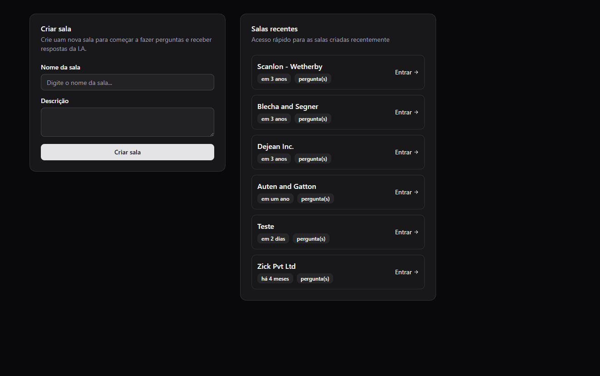
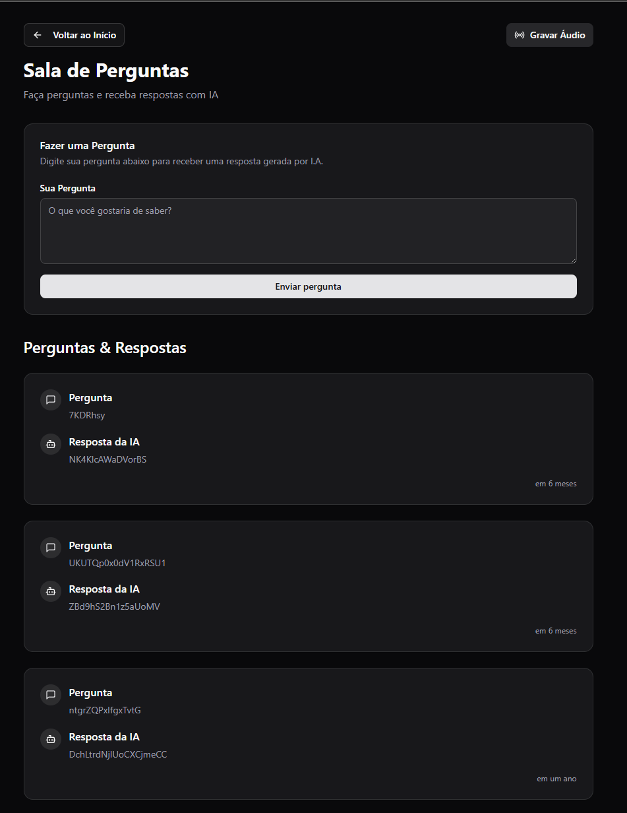

# Ask Agent - Backend (NLW Agents)

Este é o servidor backend do **Ask Agent**, uma plataforma de perguntas e respostas potencializada por agentes de IA. O backend é construído com foco em alta performance e segurança, utilizando as tecnologias mais modernas do ecossistema Node.js.

## 🚀 Tecnologias

- **Runtime**: Node.js (v20+ com suporte experimental a tipos)
- **Framework**: [Fastify](https://fastify.dev/)
- **Linguagem**: TypeScript
- **Banco de Dados**: PostgreSQL com extensão [pgvector](https://github.com/pgvector/pgvector)
- **ORM**: [Drizzle ORM](https://orm.drizzle.team/)
- **IA**: [Google Gemini AI](https://ai.google.dev/) (Transcrição e Embeddings de 768 dimensões)
- **Processamento de Áudio**: Multipart upload com suporte a buffers
- **Validação**: [Zod](https://zod.dev/)
- **Type Provider**: Fastify Type Provider Zod

## 🏗️ Arquitetura

O projeto segue uma estrutura organizada e tipada:
- `src/http/routes`: Definição de rotas para gestão de salas, perguntas e upload de áudio.
- `src/services`: Integração com serviços de IA para transcrição e geração de embeddings.
- `src/db`: Configurações de conexão, definição de schemas Drizzle e ferramentas de migração.
- `src/server.ts`: Configuração do servidor Fastify, plugins (CORS, Multipart) e registro de rotas.

## 🏁 Como Rodar

### Pré-requisitos
- Node.js (v20.x ou superior)
- Docker e Docker Compose

### Passo a Passo

1. **Instale as dependências**:
   ```bash
   npm install
   ```

2. **Configure as variáveis de ambiente**:
   Crie um arquivo `.env` baseado no `.env.example`:
   ```bash
   cp .env.example .env
   ```
   *Certifique-se de configurar a `DATABASE_URL` e, se necessário, suas credenciais de IA.*

3. **Suba o banco de dados**:
   ```bash
   docker-compose up -d
   ```

4. **Execute as migrações**:
   ```bash
   npm run db:generate
   npm run db:migrate
   ```

5. **Inicie o servidor em modo de desenvolvimento**:
   ```bash
   npm run dev
   ```

O servidor estará rodando em `http://localhost:3333`.

## 🖼️ Demonstração

<div align="center">
  
  
</div>

---
Desenvolvido durante o NLW da Rocketseat.